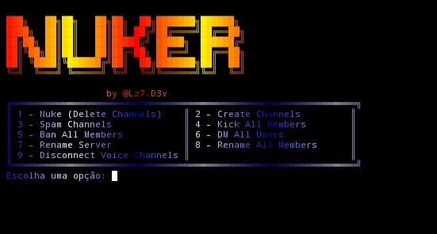

# Discord Nuke Bot



> **Aviso:** Este projeto é estritamente para fins **educacionais**.  
> O autor **@Lz7.D3v** não se responsabiliza por qualquer uso indevido desta ferramenta.

---

## 📜 Sobre

Um bot criado para fins educativos, que demonstra interações com a API do Discord, realizando ações administrativas como:

- Deletar canais (`Nuke`)
- Criar e spammar canais
- Renomear membros ou servidor
- Kickar ou banir todos os membros
- Enviar mensagens diretas em massa
- Desconectar membros de canais de voz
- Exibir "Ownado By SeuNick" no menu (editável manualmente)

---

## 🧩 Instalação

```bash
git clone https://github.com/seu-usuario/discord-nuke-bot.git
cd discord-nuke-bot
pip install -r requirements.txt
python bot.py
```

---

## 🧪 Uso

Ao rodar o script `bot.py`, será solicitado um **token válido do Discord**.  
Em seguida, um menu interativo será exibido.

> 🔐 **Senha para acessar o menu:** `2009`

---

## 🎨 Como alterar o "Ownado By..."

O menu exibe um banner com o texto: `Ownado By SeuNick`.

### Para alterar:
Abra o arquivo `bot.py` e localize onde aparece:

```python
await channel.send("Servidor Ownado by @Lz7.D3v")
```

ou

```python
await member.kick(reason="Ownado by @Lz7.D3v")
```

e substitua `"@Lz7.D3v"` pelo seu nick, por exemplo `"McPoze"`:

```python
await channel.send("Servidor Ownado by McPoze")
```

Repita isso para as funções de spam, ban, kick, rename etc.

---

## ⚙️ Requisitos

- Python 3.8+
- Uma conta Discord com token válido (user token ou bot token)

---

## ❗ Aviso Legal

> Este script **não** deve ser usado em servidores sem **permissão explícita**.  
> Ele foi criado com objetivo **educacional** para estudo da API do Discord.

---

## ✨ Créditos

Desenvolvido por **@Lz7.D3v**
